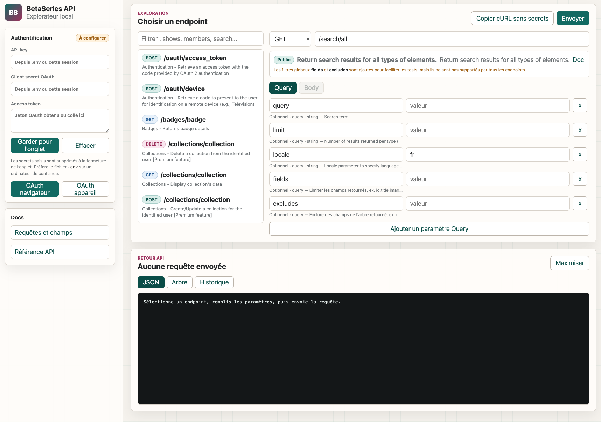

# Explorateur API BetaSeries

[](https://github.com/Macsim51/BetaSeries-API-Dev-Test/actions/workflows/ci.yml)
[](LICENSE)
[](https://nodejs.org/)

Une interface web locale pour découvrir, configurer et tester les endpoints de l’API BetaSeries. Le projet charge le catalogue depuis la documentation officielle, conserve un catalogue de secours et affiche les réponses sous forme de JSON repliable, d’arbre ou d’historique.

> Ce projet communautaire n’est ni développé, ni approuvé par BetaSeries. Respectez les [conditions d’utilisation de l’API BetaSeries](https://developers.betaseries.com/).

## Aperçu



## Fonctionnalités

- catalogue d’endpoints actualisé depuis la documentation BetaSeries ;
- recherche et configuration libre de la méthode, du chemin et des paramètres ;
- corps envoyés dans l’URL, en formulaire ou en JSON ;
- authentification OAuth par navigateur ou par code appareil ;
- visualisation JSON repliable, vue arborescente et statistiques de réponse ;
- historique limité à l’onglet courant ;
- génération d’une commande cURL dont les secrets sont remplacés par des variables d’environnement ;
- aucune dépendance npm en production.

## Prérequis

- [Node.js](https://nodejs.org/) 22 ou plus récent (version LTS maintenue) ;
- une application créée sur le portail développeur BetaSeries ;
- sa clé API et, pour OAuth, son client secret.

Déclarez `http://localhost:5177/callback` comme URL de redirection OAuth dans votre application BetaSeries. Si vous changez le port ou l’origine, adaptez cette URL des deux côtés.

## Installation rapide

```bash
git clone https://github.com/Macsim51/BetaSeries-API-Dev-Test.git
cd BetaSeries-API-Dev-Test
cp .env.example .env
```

Complétez ensuite au minimum ces valeurs dans `.env` :

```dotenv
BETASERIES_API_KEY=votre_cle_api
BETASERIES_CLIENT_SECRET=votre_client_secret
```

Lancez l’application :

```bash
npm start
```

Ouvrez [http://localhost:5177](http://localhost:5177). Aucun `npm install` n’est nécessaire : l’application utilise uniquement les API natives de Node.js et du navigateur.

## Utilisation

1. Choisissez un endpoint dans la colonne centrale ou filtrez la liste.
2. Remplissez uniquement les paramètres nécessaires.
3. Pour une route privée, obtenez un jeton avec « OAuth navigateur » ou « OAuth appareil ».
4. Cliquez sur « Envoyer », puis explorez les vues JSON, Arbre et Historique.
5. Utilisez « Copier cURL sans secrets » pour reproduire la requête dans un terminal après avoir défini `BETASERIES_API_KEY` et, si nécessaire, `BETASERIES_ACCESS_TOKEN`.

Les identifiants saisis dans l’interface sont conservés dans `sessionStorage` et disparaissent à la fermeture de l’onglet. La configuration par `.env` reste recommandée sur une machine de confiance.

L’interface demande une confirmation avant chaque requête autre que `GET`, car certaines routes peuvent modifier ou supprimer les données du compte connecté.

## Configuration

| Variable | Défaut | Rôle |
| --- | --- | --- |
| `PORT` | `5177` | Port HTTP local. |
| `HOST` | `127.0.0.1` | Interface d’écoute. Gardez cette valeur pour un usage local. |
| `APP_ORIGIN` | `http://localhost:5177` | Origine autorisée par la protection contre les requêtes intersites. |
| `BETASERIES_API_KEY` | — | Clé de l’application BetaSeries. |
| `BETASERIES_CLIENT_SECRET` | — | Secret utilisé uniquement côté serveur pour OAuth. |
| `BETASERIES_REDIRECT_URI` | `${APP_ORIGIN}/callback` | URL de retour OAuth déclarée chez BetaSeries. |
| `BETASERIES_API_VERSION` | `3.0` | Version envoyée dans `X-BetaSeries-Version`. |
| `REQUEST_TIMEOUT_MS` | `15000` | Délai maximal d’un appel externe. |
| `MAX_REQUEST_BYTES` | `65536` | Taille maximale d’un corps reçu par le serveur. |
| `MAX_RESPONSE_BYTES` | `5242880` | Taille maximale d’une réponse BetaSeries. |

## Sécurité

Le serveur écoute uniquement sur `127.0.0.1` par défaut. Il applique une politique CSP, refuse les requêtes navigateur intersites, limite les tailles, impose des délais d’expiration et n’évalue jamais le JavaScript récupéré depuis la documentation.

Ne commitez jamais `.env`, un jeton OAuth ou un client secret. Le fichier `.gitignore` les exclut, mais vérifiez toujours `git diff --cached` avant un envoi. L’application est un outil de développement local : ne l’exposez pas directement sur Internet avec des secrets dans l’environnement sans ajouter une authentification en amont.

Pour signaler une vulnérabilité, consultez [SECURITY.md](SECURITY.md).

## Architecture

```text
.
├── public/
│   ├── app.js            # contrôleur de l’interface et rendu des réponses
│   ├── endpoints.js      # catalogue local de secours
│   ├── index.html        # structure accessible de l’application
│   └── styles.css        # interface responsive
├── src/
│   ├── betaseries.js     # proxy, validation et flux OAuth
│   ├── catalog.js        # lecture sûre de la documentation et cache
│   ├── config.js         # chargement et validation de la configuration
│   └── http.js           # erreurs, corps JSON et en-têtes de sécurité
├── test/                 # tests unitaires et d’intégration
└── server.js             # routage HTTP et fichiers statiques
```

## Développement

```bash
npm run dev    # redémarrage automatique
npm test       # tests Node.js
npm run check  # syntaxe et tests
```

Les contributions sont bienvenues. Lisez [CONTRIBUTING.md](CONTRIBUTING.md) avant d’ouvrir une pull request. La CI teste le projet avec les versions maintenues de Node.js.

## Licence

Projet créé par [Macsim51](https://github.com/Macsim51) et distribué sous [licence MIT](LICENSE). Vous pouvez l’utiliser, le modifier et le redistribuer à condition de conserver la mention de copyright originale ainsi que le texte de la licence.
